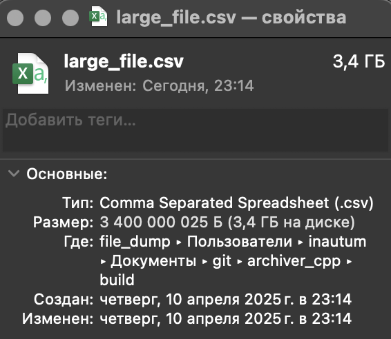
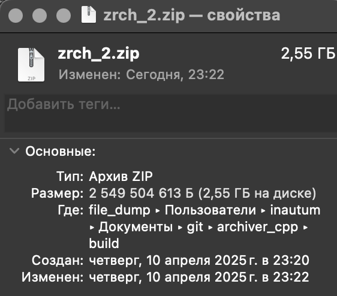
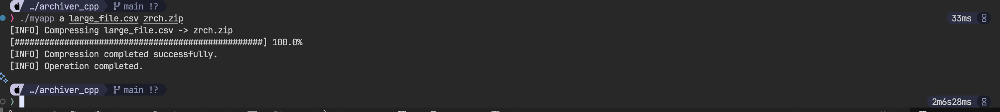
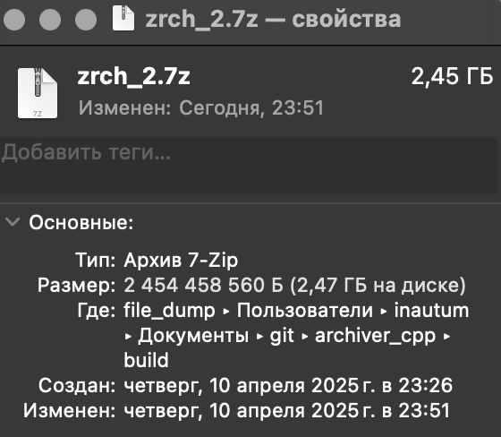
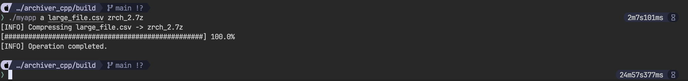
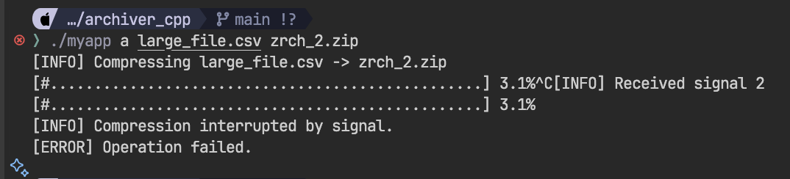

# archiver_cpp

Это кроссплатформенное консольное приложение на C++, предназначенное для сжатия и распаковки одиночных файлов с использованием библиотеки [`libarchive`](https://www.libarchive.org/).

## 📦 Возможности

- Архивация одиночных файлов в `.zip`, `.tar.gz`, `.gz`, `.7z` и др.
- Распаковка одиночных файлов из архивов
- Отображение прогресса выполнения
- Поддержка сигналов прерывания (например, Ctrl+C)
- Логирование операций

## ⚙️ Зависимости

- [`libarchive`](https://www.libarchive.org/) (лицензия BSD 3-Clause)
- Стандартная библиотека C++ (`<fstream>`, `<filesystem>`, `<iostream>`, `<atomic>`, `<csignal>`)

## 🚀 Сборка

Убедитесь, что `libarchive` установлена в системе.  
Пример сборки через `CMake`:

```bash
mkdir build
cd build
cmake ..
make
```

## Использование

### Генератор тестовых данных

```python
python generator_csv/main.py
```

Сгенерирует csv файл весом ~3.4 гб

### Архиватор

В `[название_файла]` можно указывать путь до файла, пример: `../generator_csv/large_file.csv`

В `[название_архива]` можно указывать путь до архива, пример: `../generator_csv/large_file.zip`, если такой папки не существует, она будет создана.

**Архивация**

```bash
./myapp a [название_файла] [название_архива]
```

**Разархивация**

```bash
./myapp e [название_архива] [название_файла]
```

## Примеры

### Изначальный файл

 

### Архивация zip

**Вес архива:** 



**Время архивации:** 



### Архивация 7z

**Вес архива:**



**Время архивации:**



### Прерывание

